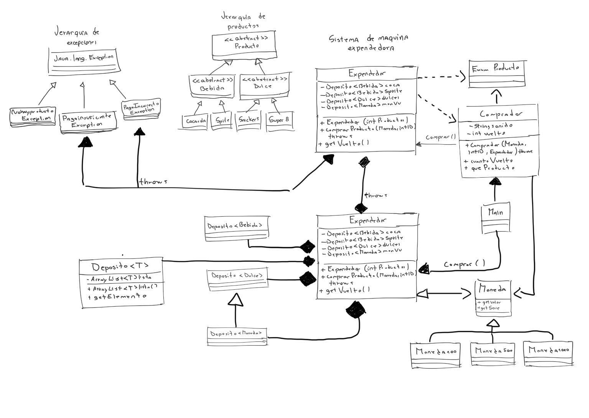

# Tarea1 G21
Integrantes:
Javiera Antonia Diaz Grandon 
Tomas Ignacio Pizarro Abarca
Pablo Sebastian Bascuñan Espina

Este proyecto consiste en la simulacion de una maquina expendedora de productos (bebidas y dulces) desarrollada en java, 
el  sistema permite gestionar el stock de productos, el pago mediante distintos tipos de monedas y el manejo de errores 
mediante excepciones personalizadas para asegurar el funcionamniento correcto.

El codigo se organiza bajo el paquete "tarea1" e incluye las siguientes funcionalidades:
sistema de prdocutos: implementacion de clases abstractas para "Bebida y "Dulce" con sus respectivos productos especificicos.
gestion de pagos: uso de una jerarquia de monedas con distintos valores.
logica de negocio: existe una clase "Expendedor" que controla los depositos y entrega productos o vuelto.

Se implementaron las siguientes excepciones para manejar los errores:
PagoIncorrectoException: se lanza cuando se intenta realizar una compra con una moneda nula.
NoHayProductoException: se lanza cuando el deposito del producto solicitado esta vacio o el indice no existe.
PagoInsuficienteExceptcion: se lanza cuando el valor de la moneda ingresada es menor al precio del producto.

Para ejecutar el proyecto:
1. Clonar el repositorio.
2. Abrir el proyecto en un IDE (intelliJ IDEA recomendado).
3. Configurar el SDK (java 17 o superior).
4. Ejecutar la clase "Main" ubicada en "src/main/java/Tarea1/Main.java".

Boceto Diagrama UML: 


Se compartio a gemini el diagrama para poder estrucutrarlo de mejor manera y hacerlo mas estetico, como resultado nos dio un codigo, generando el mismo diagrama pero digitalizado.
El diagrama digitalizado es :
```mermaid

classDiagram
    direction TB

    %% GRUPO SISTEMA CENTRAL
    subgraph Sistema_Principal
        %% CAMBIO SOLICITADO: Relación de Composición (Rombo Negro)
        %% Indica que Main es el dueño del ciclo de vida de estos objetos.
        Main *-- Expendedor : instancia y posee
        Main *-- Comprador : instancia y posee
        Comprador --> Expendedor : interactua
    end

    %% GRUPO PRODUCTOS
    subgraph Jerarquia_Productos
        Producto <|-- Bebida
        Producto <|-- Dulce
        Bebida <|-- CocaCola
        Bebida <|-- Sprite
        Bebida <|-- Fanta
        Dulce <|-- Snickers
        Dulce <|-- Super8
    end

    %% GRUPO MONEDAS
    subgraph Jerarquia_Monedas
        Moneda <|-- Moneda100
        Moneda <|-- Moneda500
        Moneda <|-- Moneda1000
        Comparable <|.. Moneda : implementa 
    end

    %% RELACIONES ESTRUCTURALES
    Expendedor *-- Deposito : tiene
    Deposito ..> Producto : guarda
    Deposito ..> Moneda : guarda

    %% DEFINICIONES DE CLASES 
    class Main {
        +main(args: String[])
    }

    class Expendedor {
        -Deposito~Bebida~ coca
        -Deposito~Bebida~ sprite
        -Deposito~Bebida~ fanta
        -Deposito~Dulce~ super8
        -Deposito~Dulce~ snickers
        -Deposito~Moneda~ monVu
        +Expendedor(num: int)
        +comprarProducto(m: Moneda, TipoProducto: EnumProducto) Producto
        +getVuelto() Moneda
    }

    class Comprador {
        -String tipo
        -int vuelto
        +Comprador(m: Moneda, TipoProducto: EnumProducto, exp: Expendedor)
        +cuantoVuelto() int
        +queProducto() String
    }

    class Producto {
        <<abstract>>
        -int serie
        +Producto(serie: int)
        +consumir()* String
        +getSerie() int
    }

    class Bebida {
        <<abstract>>
        +Bebida(s: int)
    }

    class Dulce {
        <<abstract>>
        +Dulce(s: int)
    }

    class CocaCola {
        +CocaCola(s: int)
        +consumir() String
    }

    class Sprite {
        +Sprite(s: int)
        +consumir() String
    }

    class Fanta {
        +Fanta(s: int)
        +consumir() String
    }

    class Snickers {
        +Snickers(s: int)
        +consumir() String
    }

    class Super8 {
        +Super8(s: int)
        +consumir() String
    }

    class Comparable~Moneda~ { 
        <<interface>> 
        +compareTo(m: Moneda) int 
    } 

    class Moneda {
        <<abstract>>
        +Moneda()
        +getValor()* int
        +toString() String
        +compareTo(m: Moneda) int
    }
    class Moneda100 {
        +Moneda100()
        +getValor() int
    }
    class Moneda500 {
        +Moneda500()
        +getValor() int
    }
    class Moneda1000 {
        +Moneda1000()
        +getValor() int
    }

    class Deposito~T~ {
        -ArrayList~T~ al
        +addElemento(obj: T) void
        +getElemento() T
    }

    class EnumProducto {
        <<enumeration>>
        COCA
        SPRITE
        FANTA
        SNICKERS
        SUPER8
        -int precio
        +getPrecio() int
    }

    %% EXCEPCIONES Y DEPENDENCIAS
    class RuntimeException { <<Java Class>> }
    
    RuntimeException <|-- PagoIncorrectoException
    RuntimeException <|-- NoHayProductoException
    RuntimeException <|-- PagoInsuficienteException

    Expendedor ..> EnumProducto : usa
    Comprador ..> EnumProducto : usa
    Expendedor ..> PagoIncorrectoException : throws
    Expendedor ..> NoHayProductoException : throws
    Expendedor ..> PagoInsuficienteException : throws
